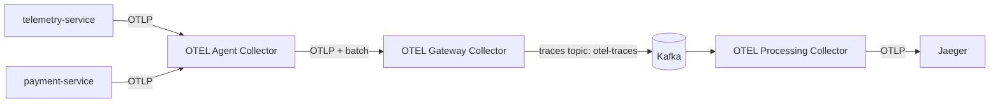

# OpenTelemetry Telemetry Pipeline Lab

This lab demonstrates a multi-stage OpenTelemetry pipeline for FastAPI services, with Kafka used as a buffering layer between collector tiers.

## Architecture

Telemetry flow:



Collector roles:

- `otel-agent`: edge receiver for service telemetry; applies `memory_limiter` + `batch`; forwards via OTLP.
- `otel-gateway`: central ingress from agent; applies `memory_limiter` + `batch`; exports traces to Kafka topic `otel-traces`.
- `otel-processor`: consumes traces from Kafka; applies `memory_limiter` + `batch`; exports to Jaeger.

## Components

- `telemetry-service` and `payment-service`: FastAPI services with OpenTelemetry instrumentation.
- `kafka`: single-node KRaft Kafka broker.
- `kafka-init`: one-shot topic bootstrapper (`otel-traces`).
- `otel-agent`, `otel-gateway`, `otel-processor`: role-separated OpenTelemetry Collectors.
- `jaeger`: trace backend and UI.

## Collector Config Files

- `agent-config.yaml`
- `gateway-config.yaml`
- `processor-config.yaml`

## Run

```bash
docker compose up --build
```

Access:

- App endpoint: `http://localhost:8000`
- Jaeger UI: `http://localhost:16686`

## Notes

- Services export OTLP to `otel-agent:4317`.
- Kafka topics are auto-created in two ways:
  - broker setting `KAFKA_AUTO_CREATE_TOPICS_ENABLE=true`
  - explicit startup job `kafka-init` creates `otel-traces`
- FastAPI service application logic is unchanged; only telemetry infrastructure was extended.
